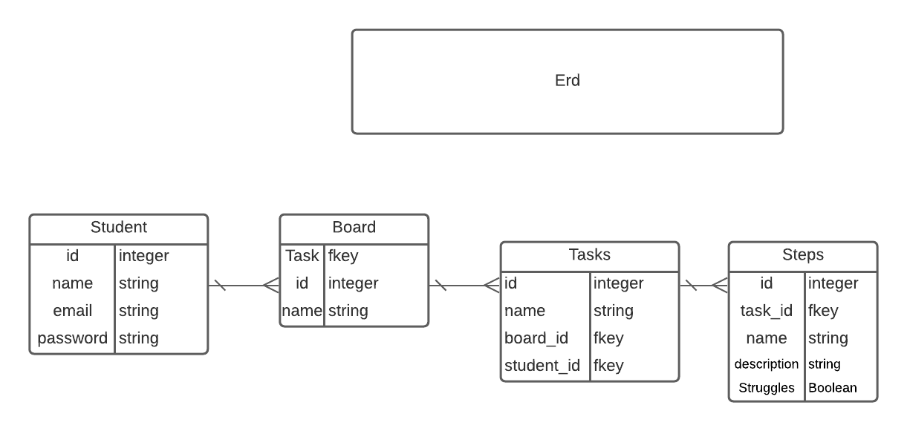
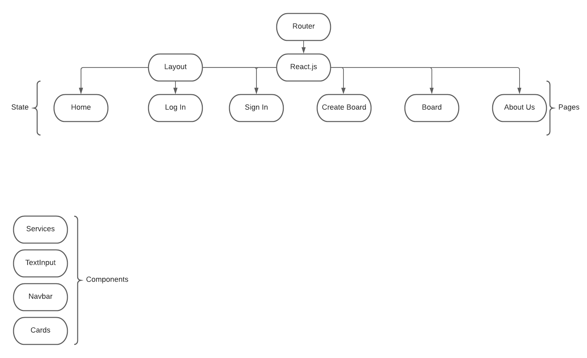

# P3

### 

### Technologies

 PostgreSQl,
 React, 
 Express,
 Node, 
 CSS,
 HTML, 
 JavaScript,
 Sequelize

### Super Trello

Have you ever need somewhere to organize your tasks? Super Trello is a great way to organize yourself or your team in order to acomplish a goal with an efficient way to share and divide tasks more efficiently than ever.
 ### Trello Board
Follow our progress at: [Trello](https://trello.com/b/QJRMErKH/tex-mex-techs) 

### ERD's 

### User Stories

* Users should be able to create an account and profile.
* Users should be able to create a task board.
* Users should be able to create multiple tasks, in the board.
* Users should be able to track the status of the task/tasks.

### Credits

Created By: Cesar De Casas, Benjamin Roth, and Raquel Gothardt

Organized with Trello
 
Created ERD with Lucidchart